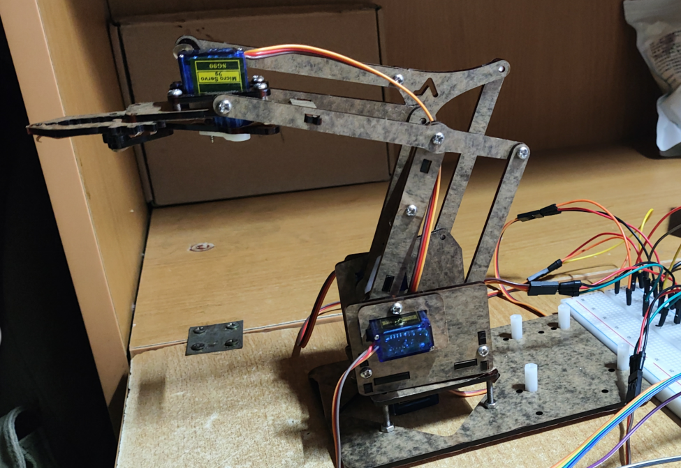
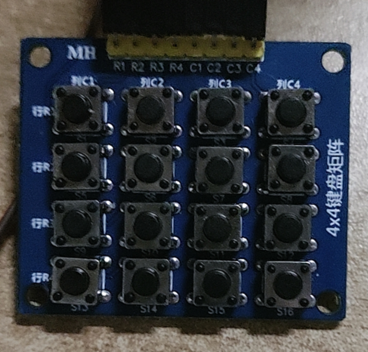
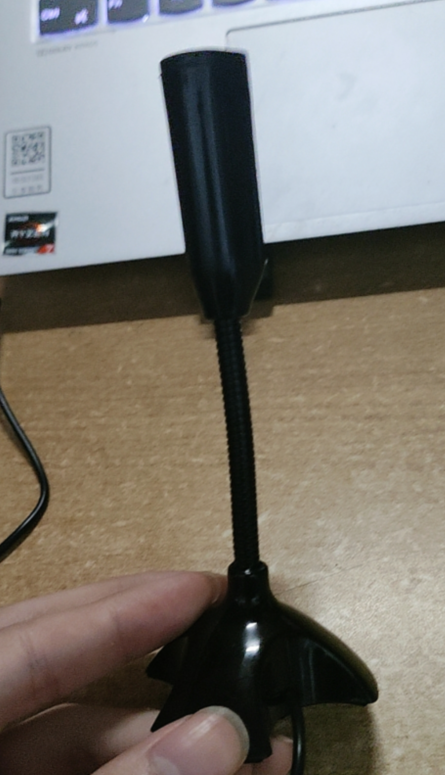
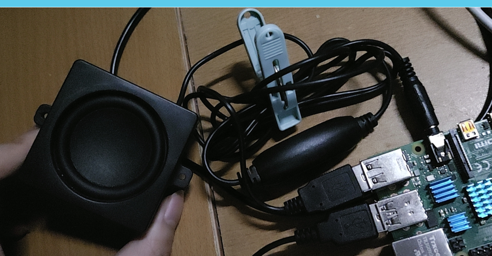

# 简介
树莓派实现的简易的机械臂程序

该机械臂可实现 左右 前后 上下 张开/闭合爪子 等基础动作（PS：由于舵机的关系，爪子的抓合力不足，或者说基本没有，如果有人可以用SG90舵机实现有力的抓取，欢迎告诉我）

该机械臂具备三个模式：

1.手动操作模式（通过矩阵键盘进行操作）

2.语音操作模式（接入麦克风后对语音指令进行操作）

3.AI模式（开启AI模式后，依然通过麦克风与AI进行沟通，AI将有操作机械臂的权限）

PS：AI模式接入的是百度文心一言的千帆模式，操作能力非常不成熟，没有实际应用价值，但就展示效果和创意而言还说得过去

# 外设连接

在树莓派4b上接入了一个麦克风(USB接口)、一个扬声器，带有四舵机(SG90)的机械臂，以及一个4*4的矩阵键盘，使用了一个亚克力板当连接中介

1. 四舵机(SG90)机械臂：

    

    【淘宝】https://m.tb.cn/h.g4BvEJQmeIumIYR?tk=xVhQWyULI5g CZ0001 「Arduino UNO R3亚克力机械臂 机器人机械手臂舵机电子实验DIY套件」

    4个SG90舵机分别连接树莓派GPIO引脚（BCM编码）如下：
    电源全部接5V，地线接地
    信号线连接 左右舵机(20) 前后舵机(21) 上下舵机(12) 张开/闭合爪子舵机(16)

2. 矩阵键盘如下：

    

    并未采用矩阵键盘所有按键，只采用第一列的4个按键，因此GPIO引脚(BCM编码)连接如下：

    R1(22) R2(27) R3(17) R4(4) C1(18)

3. 麦克风连接USB接口

    

4. 扬声器连接USB接口以及3.5mm耳机接口

    

# API调用

1. 百度智能云提供的 语音识别 API（API调用方式参照代码文件 ASR_ARM.py 以及 BaiduClient.py）

2. 百度智能云提供的 语音合成 API（API调用方式参照代码文件 TTS.py 以及 BaiduClient.py）

3. 百度智能云提供的 千帆模型(文心一言) ernie-lite-8k （API调用方式参照代码文件 BaiduAI.py）

PS: 接口1和2新用户有180天免费权益，接口3已经开放全面免费(谁知道什么时候又要付钱呢？),要使用以上三个接口记得在百度智能云申请后替换相应代码文件里的API key

# 系统信息

	My system is <Raspbian GNU/Linux 11>.
	My Python version is <Python 3.9.2>.
	My SpeechRecognition library version is <3.10.4>.
	My PyAudio library version is < 0.2.14>
	My baidu-aip versiton is <4.16.13>
    	My ffmpeg-python versiton is <0.2.0>

# 源文件简介

src里的每一个.py文件开头都注释这该模块负责的功能和作用，其余文件作用如下：

ArmPosition.txt文件用来记录机械臂4个SG90舵机当前角度

BaiduAI_SystemConfiguration.txt是用来记载AI模型的"人设",或者说是"游戏规则"

temp.txt 是代码自动生成的，用来调试时检查AI回复的原始文本

audio.wav 和 new_audio.wav 则分别时语音合成的初始音频文件以及格式转换音频文件

如果你只对语音识别感兴趣，你可以只关注 BaiduClient.py 以及 ASR_ARM.py（该文件有一处引用了ArmOperator文件，所以不能独立运行）

如果你只对语音合成感兴趣，你可以只关注 BaiduClient.py 以及 TTS.py

如果你对调用百度的AI千帆模型感兴趣，你可以只关注 BaiduAI.py

！！！注意，ARM.py文件用于负责机械臂的移动，但是该文件是根据实际舵机的安装角度设计的，如若照抄可能会影响舵机的正常使用，你可以依据注释的功能自己重新编写该文件

# 运行

1. 请安装好需要的库，不同版本可能会有不适配的问题

2. 安装好后，请按照规则连接好外设（如果连接不同的引脚，则相应代码也需要更改）

3. 请申请并修改 BaiduClient.py 以及 BaiduAI.py 两个文件 里的API key（具体的申请方法参考百度智能云官方文档）

3. 然后在src文件夹下开启终端输入'python main.py'即可运行

# 程序操作介绍

1. 手动模式操作介绍

    程序启动后第一个进入的是手动操作模式，此时只有矩阵键盘的第一列四个按钮可用
    按钮R2xC1用来切换操作的目标舵机（依次分别是 左右舵机 前后舵机 上下舵机 开合/关闭爪子舵机）
    按钮R3xC1可以操控舵机角度正向旋转（也就是 向左、向前、向上、开合爪子）
    按钮R4xC1可以操作舵机角度反向旋转（也就是 向右、向后、向下、闭合爪子）

2. 语音模式介绍

    在手动模式的情况下，按一下按钮R1xC1则进入语音模式
    对着麦克风大声说出指令（我将噪音阈值调得很高，所以要对着麦克风大声说话才有用）
    具体的指令格式参照代码

            # 定义命令列表及其对应的执行函数
            password_commands = [
                ("左转", command_left),
                ("向左", command_left),
                ("右转", command_right),
                ("向右", command_right),
                ("上抬", command_up),
                ("抬起", command_up),
                ("向上", command_up),
                ("上台", command_up),
                ("下压", command_down),
                ("向下", command_down),
                ("前进", command_forward),
                ("向前", command_forward),
                ("后退", command_back),
                ("向后", command_back),
                ("张开", command_open),
                ("打开", command_open),
                ("关闭", command_close),
                ("闭合", command_close),
                ("退出语音模式", command_quit),
                ("程序结束",command_over),
                ("复位",command_reset),
                ("点头",command_nod),
                ("摇头",command_shakehead),
                ("进入智能模式",command_AIChat)
            ]
    
    涉及移动舵机的指令必须加上 角度 数据，其余指令则不用。
    例如："左转 20度"，"张开 30度"，"复位"，"程序结束"

3. 智能模式介绍

    智能模式算是语音模式的子功能，所以需要在语音模式的情况下说出命令"进入智能模式"
    接下来你可以对着麦克风和机械臂的内嵌AI进行交流沟通，他具备一定程度的机械臂操作能力，但是整体表现特别差
    其实现想法类似于：和文心一言玩游戏，让文心一言只能输出带有规定函数调用代码的文本，再用专门的python文件解析文本并执行相应的代码
    只能说是一个创意，真正要实现使用的机械臂AI，还得取专门训练一个模型，不能像我这样"和文心一言玩游戏"
